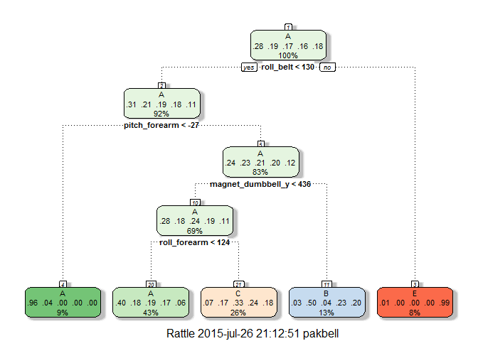

# PML_project
Coursera student 75055  
Sunday, July 26, 2015  

.

.

## Introduction

This paper documents a model that predicts if a weightlifting exercise, the Unilateral Dumbbell Biceps Curl, has been done correctly or not; if the latter the model predicts what was wrong. A correct exercise scores an A.There are five mutually exclusive incorrect ways to do the exercises (scoring B, C, D, or E). The outcome is predicted on the basis of measurements of movement sensors on a dumbbell, the waste, the arm and the forearm [1].

.

## Data

The used train and testset data are available on the internet [2] 

#### load used libraries

```
## Warning: package 'caret' was built under R version 3.1.3
```

```
## Loading required package: lattice
## Loading required package: ggplot2
```

```
## Warning: package 'rattle' was built under R version 3.1.3
```

```
## Rattle: A free graphical interface for data mining with R.
## Version 3.4.1 Copyright (c) 2006-2014 Togaware Pty Ltd.
## Type 'rattle()' to shake, rattle, and roll your data.
```

#### --- Download the train data from the internet --------------

```r
if (!file.exists("datTrain.csv")) {
    url  = "https://d396qusza40orc.cloudfront.net/predmachlearn/pml-training.csv"
    dest = "datTrain.csv"
    meth = "internal"
    quit = TRUE
    mode = "wb"
    download.file(url, dest, meth, quit, mode)
    # NOTE this works under windows 7, modify if nessesairy
} 
train0 <- read.csv("datTrain.csv",na.strings=c("NA",""))
```

#### --- Download the test data from the internet --------------

```r
if (!file.exists("datTest.csv")) {
    url  = "https://d396qusza40orc.cloudfront.net/predmachlearn/pml-testing.csv"
    dest = "datTest.csv"
    meth = "internal"
    quit = TRUE
    mode = "wb"
    download.file(url, dest, meth, quit, mode)
    # NOTE this works under windows 7, modify if nessesairy
} 
test0 <- read.csv("datTest.csv",na.strings=c("NA",""))
```

#### data exploration

The train data consists of 19622 observation of 160 variables. 
Only 406 of the 19622 observations have valid values for all the variables. 
The other 19216 observation all have have invalid values for exactly the same 100 variables. 

The distribution of the A,B,C,D,E scores of the six subjects are:

```r
table(train0$classe,train0$user_name)
```

```
##    
##     adelmo carlitos charles eurico jeremy pedro
##   A   1165      834     899    865   1177   640
##   B    776      690     745    592    489   505
##   C    750      493     539    489    652   499
##   D    515      486     642    582    522   469
##   E    686      609     711    542    562   497
```

#### data selection 

The 100 variables for which the data are mostly missing were omitted. 
From the remaining 60 variables, the first seven are purely administrative (are not movement measurements or the outcome registration), these where omitted also. 


```r
# remove mostly NA columns
NA_in_col_cnt <- colSums(is.na(train0))
keep_col      <- NA_in_col_cnt < 500
train1        <- train0[,keep_col]
# remove first seven admin columns
train2 <- train1[,-c(1:7)]
dim(train2)
```

```
## [1] 19622    53
```

```r
sum(is.na(train2))
```

```
## [1] 0
```

So the data that are useful consists of 19622 observations of 53 variables. There are no NA's in this data, all but the outcome registration (A,B,C,D,E) are numeric or integer. 

40% of the train2 data wil be set aside to validate the model (i.e. produce an out of sample error prediction)


```r
set.seed(75055)
idxValidate <- createDataPartition( y=train2$classe , p=0.4, list=FALSE )
valSet <- train2[ idxValidate,]
dim(valSet)
```

```
## [1] 7850   53
```

```r
trnSet <- train2[-idxValidate,]
dim(trnSet)
```

```
## [1] 11772    53
```


The last of this 53 is the outcome variable classe (with the values A,B,C,D and E). The outcome data were written to a vector named y -the y in y=f(x1,x2...,x53)-. 


```r
y <- trnSet[,53]
str(y)
```

```
##  Factor w/ 5 levels "A","B","C","D",..: 1 1 1 1 1 1 1 1 1 1 ...
```

The remaining data were written to a data-frame named predict -the data which can be used to predict the outcome y-. All the predict data are numeric or integer.


```r
predict <- trnSet[,-53]
str(predict)
```

```
## 'data.frame':	11772 obs. of  52 variables:
##  $ roll_belt           : num  1.41 1.42 1.48 1.42 1.43 1.43 1.42 1.55 1.57 1.59 ...
##  $ pitch_belt          : num  8.07 8.07 8.07 8.13 8.16 8.18 8.2 8.08 8.06 8.07 ...
##  $ yaw_belt            : num  -94.4 -94.4 -94.4 -94.4 -94.4 -94.4 -94.4 -94.4 -94.4 -94.4 ...
##  $ total_accel_belt    : int  3 3 3 3 3 3 3 3 3 3 ...
##  $ gyros_belt_x        : num  0.02 0 0.02 0.02 0.02 0.02 0.02 0 0 0.02 ...
##  $ gyros_belt_y        : num  0 0 0.02 0 0 0 0 0.02 0 0 ...
##  $ gyros_belt_z        : num  -0.02 -0.02 -0.02 -0.02 -0.02 -0.02 0 0 -0.02 -0.02 ...
##  $ accel_belt_x        : int  -22 -20 -21 -22 -20 -22 -22 -21 -20 -22 ...
##  $ accel_belt_y        : int  4 5 2 4 2 2 4 5 5 5 ...
##  $ accel_belt_z        : int  22 23 24 21 24 23 21 21 21 22 ...
##  $ magnet_belt_x       : int  -7 -2 -6 -2 1 -2 -3 1 -3 -1 ...
##  $ magnet_belt_y       : int  608 600 600 603 602 602 606 600 603 604 ...
##  $ magnet_belt_z       : int  -311 -305 -302 -313 -312 -319 -309 -316 -313 -314 ...
##  $ roll_arm            : num  -128 -128 -128 -128 -128 -128 -128 -129 -129 -129 ...
##  $ pitch_arm           : num  22.5 22.5 22.1 21.8 21.7 21.5 21.4 21.2 21.2 21.1 ...
##  $ yaw_arm             : num  -161 -161 -161 -161 -161 -161 -161 -161 -161 -161 ...
##  $ total_accel_arm     : int  34 34 34 34 34 34 34 34 34 34 ...
##  $ gyros_arm_x         : num  0.02 0.02 0 0.02 0.02 0.02 0.02 0.02 0.02 0.02 ...
##  $ gyros_arm_y         : num  -0.02 -0.02 -0.03 -0.02 -0.03 -0.03 -0.02 -0.02 -0.02 -0.02 ...
##  $ gyros_arm_z         : num  -0.02 -0.02 0 0 -0.02 0 -0.02 -0.03 -0.02 -0.02 ...
##  $ accel_arm_x         : int  -290 -289 -289 -289 -288 -288 -287 -288 -289 -289 ...
##  $ accel_arm_y         : int  110 110 111 111 109 111 111 108 109 109 ...
##  $ accel_arm_z         : int  -125 -126 -123 -124 -122 -123 -124 -124 -122 -125 ...
##  $ magnet_arm_x        : int  -369 -368 -374 -372 -369 -363 -372 -373 -369 -373 ...
##  $ magnet_arm_y        : int  337 344 337 338 341 343 338 336 340 335 ...
##  $ magnet_arm_z        : int  513 513 506 510 518 520 509 510 509 514 ...
##  $ roll_dumbbell       : num  13.1 12.9 13.4 12.8 13.2 ...
##  $ pitch_dumbbell      : num  -70.6 -70.3 -70.4 -70.3 -70.4 ...
##  $ yaw_dumbbell        : num  -84.7 -85.1 -84.9 -85.1 -84.9 ...
##  $ total_accel_dumbbell: int  37 37 37 37 37 37 37 36 37 37 ...
##  $ gyros_dumbbell_x    : num  0 0 0 0 0 0 0 0.02 0 0 ...
##  $ gyros_dumbbell_y    : num  -0.02 -0.02 -0.02 -0.02 -0.02 -0.02 -0.02 -0.02 -0.02 -0.02 ...
##  $ gyros_dumbbell_z    : num  0 0 0 0 0 0 -0.02 -0.02 -0.02 0 ...
##  $ accel_dumbbell_x    : int  -233 -232 -233 -234 -232 -233 -234 -231 -233 -234 ...
##  $ accel_dumbbell_y    : int  47 46 48 46 47 47 48 47 47 46 ...
##  $ accel_dumbbell_z    : int  -269 -270 -270 -272 -269 -270 -269 -268 -271 -272 ...
##  $ magnet_dumbbell_x   : int  -555 -561 -554 -555 -549 -554 -552 -557 -559 -558 ...
##  $ magnet_dumbbell_y   : int  296 298 292 300 292 291 302 292 295 302 ...
##  $ magnet_dumbbell_z   : num  -64 -63 -68 -74 -65 -65 -69 -62 -74 -66 ...
##  $ roll_forearm        : num  28.3 28.3 28 27.8 27.7 27.5 27.2 27 26.9 26.9 ...
##  $ pitch_forearm       : num  -63.9 -63.9 -63.9 -63.8 -63.8 -63.8 -63.9 -64 -64 -64 ...
##  $ yaw_forearm         : num  -153 -152 -152 -152 -152 -152 -151 -151 -151 -151 ...
##  $ total_accel_forearm : int  36 36 36 36 36 36 36 36 36 36 ...
##  $ gyros_forearm_x     : num  0.02 0.03 0.02 0.02 0.03 0.02 0 0.02 0.02 0.02 ...
##  $ gyros_forearm_y     : num  0 -0.02 0 -0.02 0 0.02 0 0 0 -0.02 ...
##  $ gyros_forearm_z     : num  -0.02 0 -0.02 0 -0.02 -0.03 -0.03 -0.02 -0.02 0 ...
##  $ accel_forearm_x     : int  192 196 189 193 193 191 193 192 192 193 ...
##  $ accel_forearm_y     : int  203 204 206 205 204 203 205 206 203 205 ...
##  $ accel_forearm_z     : int  -216 -213 -214 -213 -214 -215 -215 -216 -216 -215 ...
##  $ magnet_forearm_x    : int  -18 -18 -17 -9 -16 -11 -15 -16 -10 -9 ...
##  $ magnet_forearm_y    : num  661 658 655 660 653 657 655 653 657 657 ...
##  $ magnet_forearm_z    : num  473 469 473 474 476 478 472 472 466 480 ...
```

.

## Model building

The y and the predict can be used to build a model.


```r
model <- train(classe ~ ., method="rpart", data=trnSet)
```

```
## Loading required package: rpart
```

```r
pred <- predict(model,predict)
confusionMatrix(pred,y)
```

```
## Confusion Matrix and Statistics
## 
##           Reference
## Prediction    A    B    C    D    E
##          A 3057  981  964  843  303
##          B   53  774   65  362  307
##          C  228  523 1024  724  565
##          D    0    0    0    0    0
##          E   10    0    0    0  989
## 
## Overall Statistics
##                                           
##                Accuracy : 0.4964          
##                  95% CI : (0.4874, 0.5055)
##     No Information Rate : 0.2844          
##     P-Value [Acc > NIR] : < 2.2e-16       
##                                           
##                   Kappa : 0.3416          
##  Mcnemar's Test P-Value : NA              
## 
## Statistics by Class:
## 
##                      Class: A Class: B Class: C Class: D Class: E
## Sensitivity            0.9131  0.33977  0.49878   0.0000  0.45702
## Specificity            0.6331  0.91711  0.79010   1.0000  0.99896
## Pos Pred Value         0.4972  0.49584  0.33420      NaN  0.98999
## Neg Pred Value         0.9483  0.85271  0.88183   0.8361  0.89093
## Prevalence             0.2844  0.19351  0.17440   0.1639  0.18383
## Detection Rate         0.2597  0.06575  0.08699   0.0000  0.08401
## Detection Prevalence   0.5223  0.13260  0.26028   0.0000  0.08486
## Balanced Accuracy      0.7731  0.62844  0.64444   0.5000  0.72799
```

We can visualize the decision tree using the rattle library.


```r
fancyRpartPlot(model$finalModel)
```

 

The inside sample accuracy of the model is about 50%. It is clear that this not a very good model.

However the model can be used to demonstrate how the the model building and testing process should go. It is the main object of this paper to show the steps in that process, so for the moment we will not try to find a better model, but work with this one. (See the discussion section for suggestions for a better model choice.)

The next step in the process is to validate the model (i.e. use the valSet data to compute the out of sample accuracy).

.

## Validation 

First build the y and predict for the validation data.


```r
yVal       <- valSet[, 53]
predictVal <- valSet[,-53]
```

Then use our model to predict on the out of sample data, and construct a confusion matrix to see how good the prediction is.


```r
predVal <- predict(model, predictVal)
confusionMatrix(predVal, yVal)
```

```
## Confusion Matrix and Statistics
## 
##           Reference
## Prediction    A    B    C    D    E
##          A 2029  651  620  597  216
##          B   42  513   47  222  190
##          C  157  355  702  468  395
##          D    0    0    0    0    0
##          E    4    0    0    0  642
## 
## Overall Statistics
##                                           
##                Accuracy : 0.495           
##                  95% CI : (0.4839, 0.5062)
##     No Information Rate : 0.2843          
##     P-Value [Acc > NIR] : < 2.2e-16       
##                                           
##                   Kappa : 0.3397          
##  Mcnemar's Test P-Value : NA              
## 
## Statistics by Class:
## 
##                      Class: A Class: B Class: C Class: D Class: E
## Sensitivity            0.9091  0.33772  0.51278   0.0000  0.44491
## Specificity            0.6290  0.92087  0.78784   1.0000  0.99938
## Pos Pred Value         0.4933  0.50592  0.33799      NaN  0.99381
## Neg Pred Value         0.9457  0.85284  0.88446   0.8361  0.88881
## Prevalence             0.2843  0.19350  0.17439   0.1639  0.18382
## Detection Rate         0.2585  0.06535  0.08943   0.0000  0.08178
## Detection Prevalence   0.5239  0.12917  0.26459   0.0000  0.08229
## Balanced Accuracy      0.7690  0.62929  0.65031   0.5000  0.72214
```

The good news is that the out of sample accuracy is only slightly smaller than the in sample accuracy (49% compared to the original 50% accuracy). 

So with this model we can hope to get about 49% (i.e. about 10 out of the 20 cases) of predictions on unseen data correct.

.

## predicting the results of the test data

The model can also be used to predict the outcomes of our test data.

The first step is to remove the unwanted columns from the test set. To do that we must use the keep_col vector we constructed earlier. 

The next step is to construct the y and the predict data for the test data.


```r
# remove unwanted colums
test1  <- test0[,keep_col]
tstSet <- test1[,-c(1:7)]
# construct yTst and predictTst
yTst    <- tstSet[, 53]  
predTst <- tstSet[,-53]
```

Then use our model to predict the outcomes of our test data,


```r
# produce the tstVals
tstVal <- predict(model, predTst)
# show the reult
tstVal
```

```
##  [1] C A A A A C C A A A C C C A C A A A A C
## Levels: A B C D E
```

The results are very suspect, there seem to be no cases B,D or E.

And indeed the Coursera [5] site reported that only 8 out of the 20 predictions were correct.

According to the decision tree above, B is the best second prediction when a prediction A is incorrect.  
For an incorrect C the alternatives B,D or E are about as likely (all three about 20%). To keep things simple I will replace an incorrect C also with a B.  
So when an answer is incorrect I will try B as an alternative.

Now Coursera reports 16 out of 20 correct.

.

## Discussion 

The found model is clearly not that good. The logical thing to do is to spend effort and time to find a better one. So that is what I tried to do. I had especially high hopes for the random forest model. Alas, my computer running on 4 of its 7 cores was still busy after 3.5 hours, I ran out of time and had to redirect my efforts. With a heavy heart I killed the job. 

To show that I understood the required steps in the process, I decided to work with a simple decision tree (which still takes 2 minutes to compute).

The main lesson learned is that for machine learning even on moderate big data (in our case say 20,000 cases of 50 variables) performance is an issue (for possible solutions see [4])

.

## References

[1] Ugulino, W.; Cardador, D.; Vega, K.; Velloso,E.; Milidiu,R.; Fuks,H. Wearable Computing: Accelerometers' Data
Classification of Body Postures and Movements [(www->)](http://groupware.les.inf.puc-rio.br/har)  
[2] train data [(www->)](https://d396qusza40orc.cloudfront.net/predmachlearn/pml?training.csv); test data [(www->)](https://d396qusza40orc.cloudfront.net/predmachlearn/pml?testing.csv)  
[3] An Introduction to Statistical Learning with Applications in R, Gareth James, Daniela Witten, Trevor Hastie and Robert Tibshirani [(www->)](http://www-bcf.usc.edu/~gareth/ISL/data.html)  
[4] Model Training and Tuning [(www->)](http://topepo.github.io/caret/training.html#custom)  
[5] Coursera, Practical Machine Learning [(www->)](https://www.coursera.org/course/predmachlearn)

